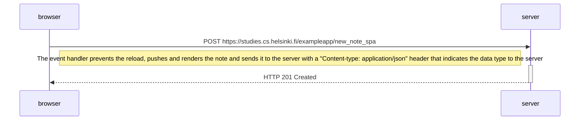

# Exercise 0.6

```mermaid
sequenceDiagram
    participant browser
    participant server

    browser->>server: POST https://studies.cs.helsinki.fi/exampleapp/new_note_spa
    Note right of browser: The event handler prevents the reload, pushes and renders the note and sends it to the server with a "Content-type: application/json" header that indicates the data type to the server
    activate server
    server-->>browser: HTTP 201 Created
    deactivate server

```
